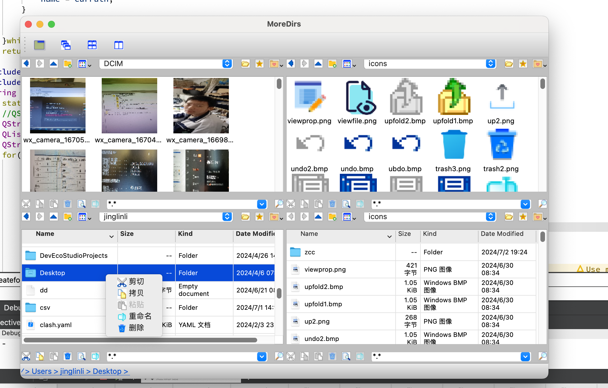
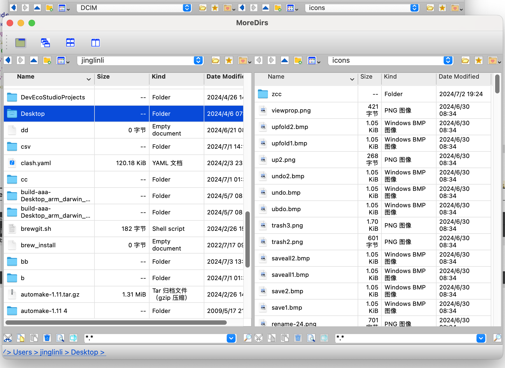
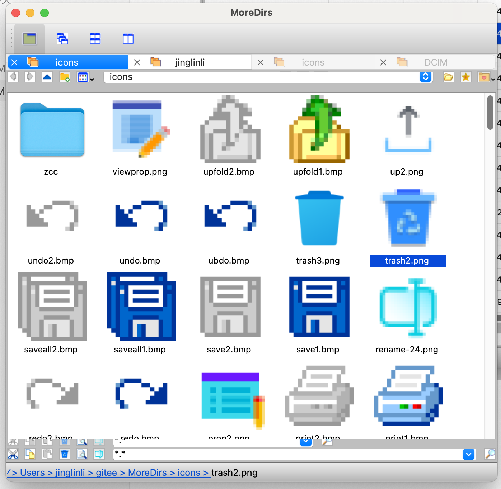

# qt-moredirs

#### features

#### summary

* show  2 dirs (tiles) or 4 dirs (tile/tab view)

#####  support：

cut/copy/paste/dag 

Show: largicon icon

### GUI

#### tile 4 dirs

# tile 2 dirs

#### Tabs view 4dir

